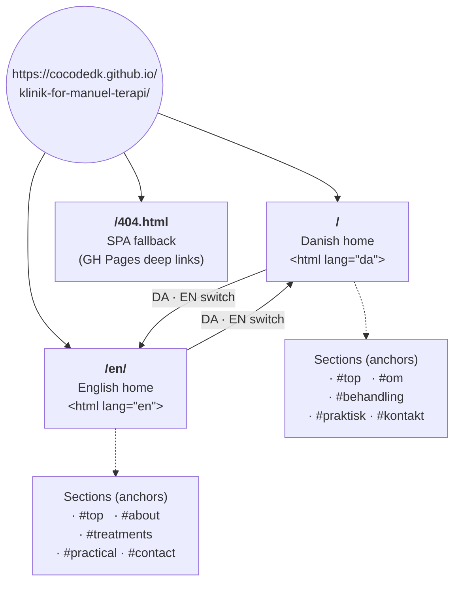
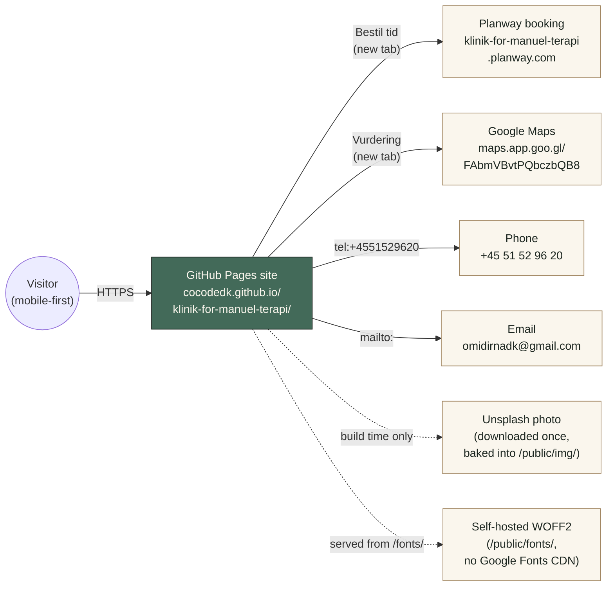

# Klinik for Manuel Terapi

Bilingual mobile-first landing page for Klinik for Manuel Terapi in
Frederiksberg. Routes traffic to the existing
[Planway booking widget](https://klinik-for-manuel-terapi.planway.com/) and
exposes one-tap call/email above the fold.

- **Live**: <https://cocodedk.github.io/klinik-for-manuel-terapi/>
- **English**: <https://cocodedk.github.io/klinik-for-manuel-terapi/en/>
- **Stack**: Vite + React 18 + TypeScript, plain CSS, prerendered to static
  HTML at build time.
- **Hosting**: GitHub Pages (project page).
- **Spec & plans**: see [`docs/`](docs/) — start with [`docs/spec.md`](docs/spec.md).

## Site map



Both routes mount the same `Home` component and differ only in the content
object (`src/content/da.ts` vs `src/content/en.ts`). `vite-react-ssg`
prerenders both as static HTML at build time; the React bundle hydrates
afterwards.

## How the site talks to the outside world



Runtime traffic from the site is intentionally minimal. Only two
user-initiated outbound clicks: the Planway booking widget and the Google
Maps link. Phone and email go through the OS via `tel:` / `mailto:`. There
is no analytics, no cookies, no third-party fonts, no embedded scripts.

| External resource | How it's reached | When |
|---|---|---|
| Planway booking widget | `<a target="_blank">` from "Bestil tid" / "Book a time" CTAs | Click |
| Google Maps | `<a target="_blank">` from the rating chip | Click |
| Visitor's phone app | `tel:+4551529620` href | Click |
| Visitor's mail client | `mailto:omidirnadk@gmail.com` href | Click |
| Unsplash | downloaded once during plan 01, image lives in `/public/img/` | Build only |
| Google Fonts | not used; WOFF2 fonts are self-hosted under `/public/fonts/` | Never |
| Analytics / cookies | none | Never |

## Quick start

```bash
pnpm i
pnpm dev          # Vite dev server on http://localhost:5173/klinik-for-manuel-terapi/
pnpm tsc --noEmit # type-check
pnpm build        # vite-ssg build → dist/index.html + dist/en/index.html
pnpm preview      # serve dist/ on http://localhost:4173/
```

After `pnpm build` the deploy artifact is the entire `dist/` directory.

## Deploy

GitHub Pages is wired by `.github/workflows/deploy-pages.yml`. On every push
to `main` it runs `pnpm build`, copies `dist/index.html` to `dist/404.html`
(SPA deep-link fallback), and uploads `dist/` as the Pages artifact.

One-time setup after pushing the first commit:

1. Repo → **Settings → Pages → Source: GitHub Actions**.
2. Wait for the first CI run, then run `./scripts/setup-repo.sh` from a
   shell with `gh` admin auth to lock branch protection.

## Repo layout

```
.
├── docs/                      ← spec, design, content, plan files
├── src/                       ← React app (created in plan 01)
├── public/                    ← static assets (img/, fonts/)
├── .github/                   ← workflows, templates, CODEOWNERS
├── .githooks/                 ← pre-commit + commit-msg
├── scripts/                   ← install-hooks.sh, setup-repo.sh
├── booking-ease-connect/      ← original Lovable mirror (gitignored)
├── CLAUDE.md                  ← agent conventions
├── CONTRIBUTING.md
├── SECURITY.md
├── LICENSE                    ← Apache-2.0
└── README.md                  ← this file
```

## Author

Built by [Babak Bandpey](https://linkedin.com/in/babakbandpey) for
[Cocode](https://cocode.dk) on behalf of Klinik for Manuel Terapi.

## License

Apache-2.0 · © 2026 [Cocode](https://cocode.dk) · Created by
[Babak Bandpey](https://linkedin.com/in/babakbandpey)

## Credits

- Hero photo: chosen from [Unsplash](https://unsplash.com/) during plan 01;
  the photographer name and source URL are recorded here once locked.
- Webfonts: [Newsreader](https://fonts.google.com/specimen/Newsreader) and
  [Manrope](https://fonts.google.com/specimen/Manrope), both OFL, self-hosted.
